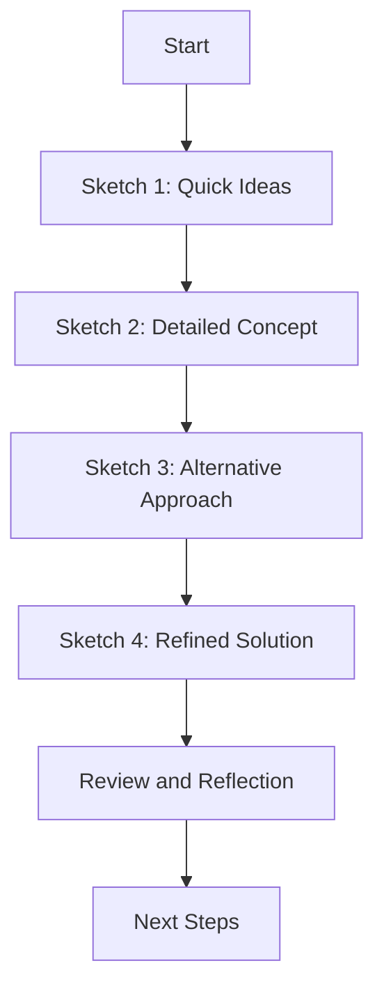

# Four-Sketch Process: {{title}}

## Project Overview
- **Project Name**: 
- **Objective**: 
- **Target Audience**: 
- **Key Constraints**: 

## Process Structure

## Sketch 1: Quick Ideas
**Time**: 5 minutes

- [ ] Set timer for 5 minutes
- [ ] Rapidly generate multiple rough ideas
- [ ] Use simple shapes and stick figures
- [ ] Label key elements

### Ideas Generated:
1. 
2. 
3. 
4. 
5. 

### Quick Reflection:
- Most promising idea: 
- Unexpected insight: 

## Sketch 2: Detailed Concept
**Time**: 10 minutes

- [ ] Set timer for 10 minutes
- [ ] Choose one promising idea from Sketch 1
- [ ] Add more detail to the concept
- [ ] Consider user flow and interactions
- [ ] Include annotations explaining functionality

### Concept Details:
- Core idea: 
- Key features:
  1. 
  2. 
  3. 
- User flow: 
- Potential challenges: 

## Sketch 3: Alternative Approach
**Time**: 10 minutes

- [ ] Set timer for 10 minutes
- [ ] Explore a completely different approach
- [ ] Challenge assumptions from previous sketches
- [ ] Think about unconventional solutions
- [ ] Annotate unique features and benefits

### Alternative Concept:
- Core idea: 
- How it differs from Sketch 2: 
- Unique features:
  1. 
  2. 
  3. 
- Potential benefits: 
- Possible drawbacks: 

## Sketch 4: Refined Solution
**Time**: 15 minutes

- [ ] Set timer for 15 minutes
- [ ] Combine best elements from previous sketches
- [ ] Focus on clarity and completeness
- [ ] Include all necessary details for implementation
- [ ] Prepare to present and explain your solution

### Refined Solution Details:
- Core concept: 
- Key features:
  1. 
  2. 
  3. 
  4. 
- User journey: 
- Implementation considerations: 
- Potential impact: 

## Review and Reflection
- What worked well in each sketch?
  - Sketch 1: 
  - Sketch 2: 
  - Sketch 3: 
  - Sketch 4: 
- What challenges did you encounter?
- How did your ideas evolve through the process?
- What key insights did you gain?
- How does the final solution address the initial objective?

## Next Steps
- [ ] Share refined solution with stakeholders
- [ ] Gather feedback
- [ ] Plan prototype development
- [ ] Schedule follow-up ideation session (if needed)

## References and Resources
- Related notes: [[]]
- Inspiration sources: 
- Relevant research: 

Remember to attach or link your sketches to this note for future reference!